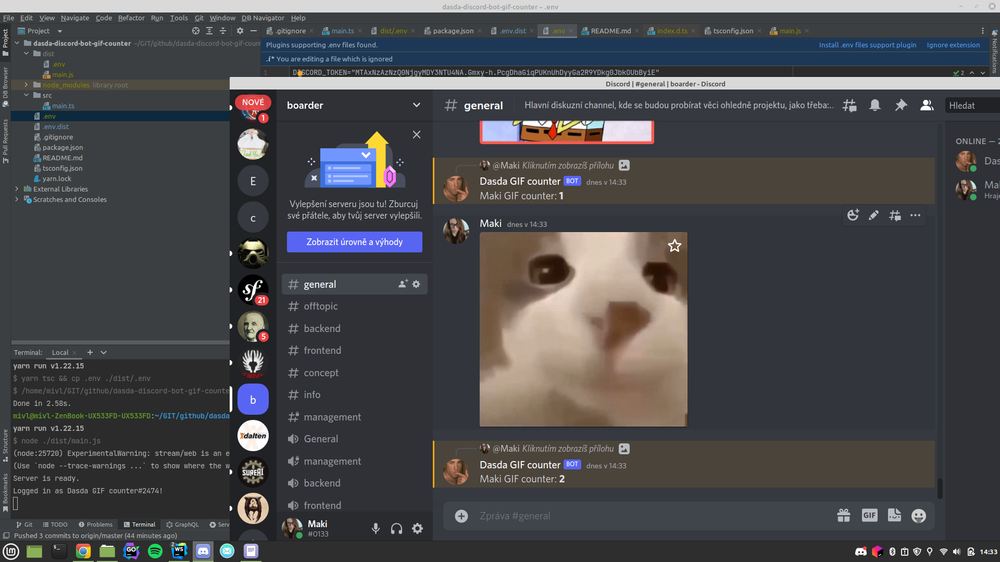

DASDA Gif counter bot
====================

MEME robot, který bude na zprávu od dasdy obsahující GIF 
(nebo jinou přílohu) odpovídat počítadlem a odpovědí.

Bot si ukládá state automaticky do souboru: `./dist/data/state.json`. Tento state se každý týden resetuje (dle feature requestu).

Ukládání je do JSON souboru, protože pro projekt tohodle rozměru to nemá význam a navíc se nebudu přece dělat s databázovou vrstvou jen kvůli MEMU :D.

## Nastavení Discord bota

1. [Zde](https://discord.com/developers/applications/) si vytvořit novou aplikaci v sekci `Applications`
2. V Bot -> Privileged Gateway Intents zaškrtnout všechno
3. V Bot -> TOKEN si zkopírovat token (pokud tam token není, tak zmáčkneme `Reset token` button) 
4. V OAuth2 -> Url generator zaškrtneme: "bot" a potom v dolním okne: "Read Messages/View Channels" a ze sloupce "Text permissions" všechno
5. Zkopírujeme si vygenerovanou URL a tu budeme používat pro invite na servery

## Instalance:

1. Zkopírovat `.env.dist` a pojmenovat soubor jako: `.env` 
2. přepsat v souboru: `.env` hodnotu `DISCORD_TOKEN` za token získaného z #Nastavení Discord Bota
2. přepsat v souboru: `.env` hodnotu `USER_INTERACTION_TAG` za user tag, na kterého chceme, aby BOT reagoval
3. `yarn install`
4. `yarn build`

## Spuštění:

* `yarn start:prod`